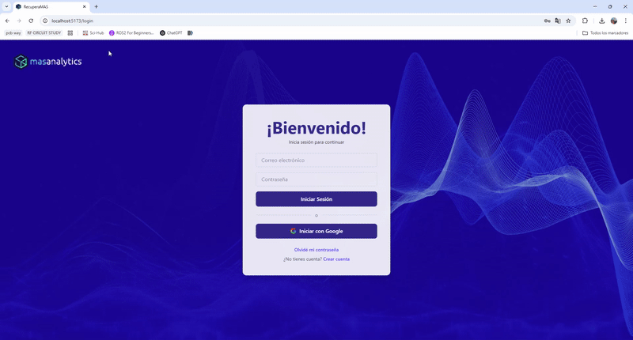

# Demo WEBAPP – React + Vite



Proyecto demo de la WebApp **RecuperaMás**. Lo ideal habría sido realizar un breve borrador o *mockup* en Figma (u otra plataforma similar) antes de comenzar a codificar, definiendo la paleta de colores y los requerimientos básicos. Sin embargo, dado que se trata de una demo, opté por una implementación más minimalista.

Creé un código base funcional, pero con amplio margen de mejora. Además, en este repositorio incluí un video de demostración para observar su funcionamiento sin necesidad de ejecutarlo localmente.

> **IMPORTANTE:** Para iniciar sesión basta con ingresar un correo cualquiera y cualquier contraseña.

---

## 🎨 Paleta de colores

Extraje los colores principales de la página original: azul oscuro en la barra de navegación, fondo blanco y algunos tonos morados intercalados. También incluí algunas imágenes útiles directamente desde la misma fuente.

---

## 🛠️ Stack tecnológico

Utilicé **React + Vite**, junto con **Tailwind CSS** para el diseño y librerías como **Chart.js** y **react-chartjs-2** para la visualización de datos:

- **React** – Biblioteca principal para construir la interfaz.
- **Vite** – Bundler ultrarrápido para desarrollo con React.
- **Chart.js + react-chartjs-2** – Para la visualización de métricas.
- **Tailwind CSS** – Para un diseño moderno y responsivo.
- **React Icons** – Íconos visuales para mejorar la experiencia de usuario.

---

## ▶️ Instrucciones para ejecutar

### 🔧 Ejecutar de forma local

1. **Instalar Node.js y npm**  
   Visita [https://nodejs.org/](https://nodejs.org/)  
   Descarga e instala la versión LTS para tu sistema operativo.  
   Verifica la instalación ejecutando en la terminal:
   ```bash
   node -v
   npm -v
